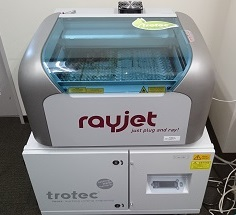
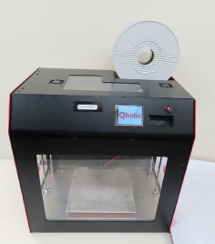

### 端末室複合機について
 次の端末室および附属図書館に設置しています。  
 - 人文棟特殊端末室   
 - 自然棟特殊端末室  
 - 教育用端末室  
 - マルチメディア教育実習室  
 - 附属図書館
 
#### 利用方法
 印刷には，ユーザID（学籍番号）が必要です。  
 ユーザIDごとに付与されるポイントを利用して印刷します。
 
##### 【利用方法 : 端末室PCから印刷を実行する】
1. 端末室および附属図書館のPCから印刷を実行します。  
 このとき，プリンタに，prn\_kiban（IOGATE8上） を指定してください。
 
2. 複合機の操作パネルを操作して出力します。  
 学生証をかざして，または，ユーザID（学籍番号）とパスワードを入力して，ログインします。  
 表示された印刷ジョブから，選択して印刷します。
 
  複合機の操作方法に関しましては，下記操作マニュアルをご参照下さい。  
  [複合機 操作簡易マニュアル(暫定版)](IOGateV3_MPF_Manuall_日本語.pdf)
> 複合機にUSBメモリを直接接続して印刷する機能はありません。パソコンにUSBメモリを接続し，印刷して下さい。
 
##### 【How to print from PCs in the PC room with MFP】
  Please check the operation manual below.  
  [MFP simple operation manual (tentative name)](IOGateV3_MPF_Manuall_v.1.1_en.pdf)
#### 【印刷ポイントについて】
 印刷は，各ユーザごとに付与されるポイントを利用して行います。  
 年度毎に設定するポイントで換算される制限枚数までは，課金を必要とせずに利用できます。  
 教育研究用に限り，有償で印刷制限枚数を増加させることができます。
 
 年度初めに一人あたり1200ポイントが付与されます。  
 ポイントがなくなった場合には，教育研究のための利用に限り，1000ポイント単位での追加購入もできます。  
 情報基盤センター利用支援室へご相談ください。  
 [プリンタ印刷利用ポイント追加申請書（利用者負担）](point_tsuika_riyosya_f.pdf)   
 [プリンタ印刷利用ポイント追加申請書（コース等経費負担）](point_tsuika_course_f.pdf)
 利用ポイント数／付与ポイント数 は，複合機の操作パネルで確認できます。  
> 白黒／カラーの設定は，パソコン側のプリンタのプロパティにて設定して下さい。オンデマンド端末よりの切換はできなくなりました。
 
#### 【ポイント換算について】
 （１）PCからの印刷時  
 白 黒 ：　4ポイント / 1面　（全サイズ）  
 カラー：12ポイント / 1面　（全サイズ）
 
 （２）複合機でのコピー時  
 白 黒 ：　20ポイント / 1面　（全サイズ）  
 カラー：100ポイント / 1面　（全サイズ）
 
 ※スキャナ使用時にはポイントを消費いたしません。
 
#### 【用紙サイズ】
 A4，A3，B4 の用紙に対応しています。  
 B5，Letter sizeには対応しておりません。  
 （用紙の持ち込みはできません）  
> ラベル用紙（タックシール用紙）は故障の原因となりますので，使用しないで下さい。
 
#### 【故障などが起こったとき】
 紙詰まり，用紙切れ，トナー切れなどの場合は，情報基盤センター 利用支援室までお知らせください。  
 備え付けの内線電話をご利用ください（内線番号：6710） ☆端末室の場所もご連絡下さい。  
 （附属図書館の場合は，図書館職員にお知らせ下さい）
 
 
### 出力サービスの利用方法
 情報基盤センター2階の共同端末室に，大判プリンタおよびレーザーカッター，3Dプリンタを設置しています。  
##### 令和3年3月に大判プリンタが新しくなりました。
 従来機種より高速になりました。高精度で高品質な大判印刷が可能となりましたので，ポスターなどの印刷に，ご利用ください。  
##### 平成29年11月にレーザーカッターのサービスを開始しました。
 様々な材料を切断・彫刻できますので，教材・教具・模型などの加工にご利用下さい。  
##### 令和元年5月に３Ｄプリンタのサービスを開始しました。
 様々な立体を造形できますので，教材・教具・模型などの作成にご利用下さい。  
  

  
#### 大判プリンタ利用方法：
 情報基盤センター利用支援室で，予約してください。  
 [大判プリンタ利用申請書](printer_f.pdf)   
 学生または学生団体の方は，指導教員またはコース長・専攻長等に事前に許可をもらってください。  
 印刷には時間がかかりますので，スケジュールに余裕を持ってお越し下さい。
 
##### 型式：
 EPSON SC-P8050 B0プラス 8色プリンター
 
##### 用紙サイズ：
 用紙幅 111.8cm まで（B0ノビ）  
 PowerPointの場合，A0の規格まで可能。
 
##### データ形式：
 Microsoft PowerPoint  
 Adobe Illustrator  
 Adobe Photoshop  
 など ※PostScript非対応  
 （Wordや一太郎, PDF, 画像ファイルなども可能です。ご相談ください。）  
  
> ご注意  
 標準フォント以外のフォントを使用されている場合，正常に印刷できない場合がございます。  
 その際は「フォント埋め込み」を行ったPDFファイルに保存して下さい。
 
##### 用紙：
 本センターが用意している次の用紙をご利用ください。  
 （用紙の持ち込みはできません）  
 光沢フォト用紙 -------------------（写真，CG等のデザイン向け）  
 半光沢フォト用紙 -----------------（一般のポスター，写真を含んだポスターセッション向け）  
 コート紙または厚手コート紙 -----（費用をかけたくない，印刷画質（色）にこだわらない場合）  
 ソフトクロス ---------------------（折りたたんで持ち運びが可能で，学会ポスターなどに最適）  
 キャンバス -----------------------（デジタルファインアートや写真の出力に最適）  
 耐久バナー -----------------------（耐久性，耐水性に優れており屋外バナーなどに最適）
 
##### 参考：
[PowerPointでの大型ポスター作成の手引き](PowerPointでの大型ポスター作成の手引き.pdf)  
[PowerPoint　A0テンプレート](PowerPoint_Template_A0.pptx)
##### 印刷料金：
 ご利用の経費は，コース等の配分経費から差し引かせていただきます。
 
  
#### レーザーカッター利用方法：
 情報基盤センター利用支援室で，ご希望の日時を予約してください。  
 [施設利用申請](https://forms.office.com/r/zPdcbcB84a)  
  
> 火災など，事故防止のため当センター職員が立ち会わせていただきます。
   
##### 材料について：
 加工する材料は各自お持ちになってください。  
 試し加工を推奨しておりますので，材料は余裕を持ってご用意ください。  
 当センターでは，材料をご用意しておりません。
 
##### 加工可能な素材：
 木材・アクリル・プラスチック（塩化ビニール製は不可）・紙・ゴム  
 など  
 ※ただし，曲面を加工することはできません。  
##### 加工不可能な素材：
 塩化ビニール製の素材・金属など  
 （その他，加工時に有毒ガスを発生する素材）
 
  
##### 加工最大サイズ：
 457mm×305mm  
  
 （高さ・厚さは約150mmまで加工用テーブルに入りますが，  
 　切断・加工できる厚さ・深さは素材によりますが，5mm程度です）
 
##### データ形式：
 Adobe Illustrator  
 CorelDraw  
 Inkscape  
 各種CAD  
 など  
##### 参考：
[レーザーカッター作業の流れ](laser2.pdf)  
[レーザーカッター加工データ作成の手引き](laser1.pdf)  
[レーザーカッター実寸テンプレート（Illustratorの形式）](rayjettemplate1.ai)
  
#### ３Ｄプリンタ利用方法：
 情報基盤センター利用支援室で，ご希望の日時を予約してください。  
 [施設利用申請](https://forms.office.com/r/zPdcbcB84a)  
 作成には時間がかかりますので，スケジュールに余裕を持ってお越し下さい。  
> 火傷など，事故防止のため当センター職員が立ち会わせていただきます。  
  
##### 型式：
 　Qholia 3Dプリンター
 
  
##### 材料について：
 ・使用可能素材： PLA, ABS など  
 　  
 　3Dプリンタ用フィラメント(1.75mm)は，各自ご購入ください。  
 　事前に，情報基盤センター利用支援室へご相談ください。  
##### 造形可能範囲：
 　X 210mm　×　Ｙ 205mm　×　Ｚ 205mm   
##### データ形式：
 STL形式  
 　STLデータを KISSlicer でスライスし，Ｇコードデータを作成します。  
  
 　※データ保存用の SDカード(SDHC) をご用意下さい。  
  
 STL形式とは  
 　STL(STereoLithography)データ形式  
 　3D CADソフト用のファイルフォーマットの一つで，3Dプリンタでは最も使用されているファイルフォーマット  
##### 参考：
[Qholiaについて](https://q-ho.com/qholia/)  
[Qholia 活用記録](https://fanblogs.jp/tamu3dprinter/)  
  
[KISSlicer](https://www.kisslicer.com/)  
[3Dプリンタ用フィラメント](https://www.iodata.jp/product/verbatim/3dfilament/)  

